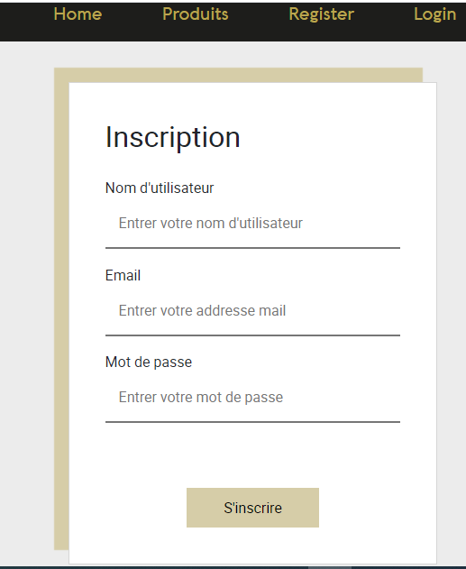
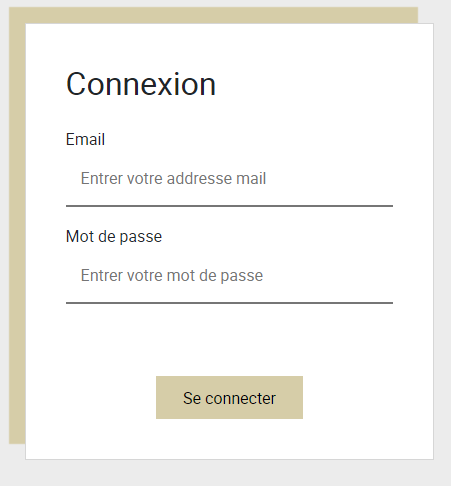

# SITE DE ECOMMERCE OMEGA GAMING

*OMEGA GAMING est un site Web de commerce de produits électroniques crée à l'aide des technologies symfony et de reactjs*

#### INSTALLATION ET EXECUTION
**INSTALLATION**

_Pour intaller l'application taper sur le terminal les commandes suivantes_
- _Dans le dossier server faire la commande **symfony install**_
- _Dans le dossier client faire la commande **npm install**_

**EXECUTION**

Pour lancer le site il faut exécuter les commandes dans le terminal suivants:
- _Dans le dossier server sur le terminal taper **symfony server:start**._ 

    Aller dans son navigateur  et taper cette URL 'http://localhost:8000/api'
- _Dans le dossier client sur le terminal taper **npm start**._ 

    Aller dans son navigateur  et taper cette URL 'http://localhost:3000'

#### TECHNOLOGIES
**Framework symfony** 
_Côté  Back ou récuperation et insertion des données dans la base de données_

**API platform** 
_Protocole qui facilite la communication entre le coté client et le coté backend_

**Reactjs** 
_Pour le côté  client ou l'affichage dans le navigateur_

## PRESENTATION DU PROJET

Omega Gaming se décompose en deux parties :
1. Le front office ou côté client qui est la partie visible par les internautes.
    - home: représente la vitrine du site et présente l'enseigne et ses produits
    - products: présente tous les produits en stock
    - product: donne la description d'un produit et la fiche technique de celui-ci
    - register: contient un formulaire d'incription pour l'utilisateur **"http://localhost:3000/users/register"**

    

    - login: contient un formulaire de connexion pour l'utilisateur **"http://localhost:3000/users/login"**

    

2. Le back office ou l'espace d'administration qui est uniquement visible par l'administrateur.
    - Ici il pourra gérer le contenu et les fonctionnalités du site.
    
    - **Comment y accéder ?**
        - _Le token de connexion_
        - _Vous pouvez accéder à cette page en tapant sur la barre de recherche de votre navigateur l'url suivante:  **http://localhost:3000/admin**

    - **Les recommandations**
       - _Mettre des photos à fond blanc_

